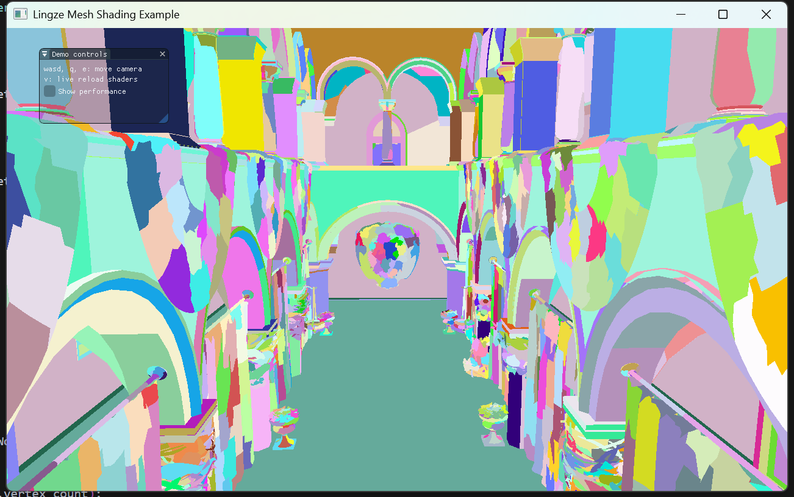
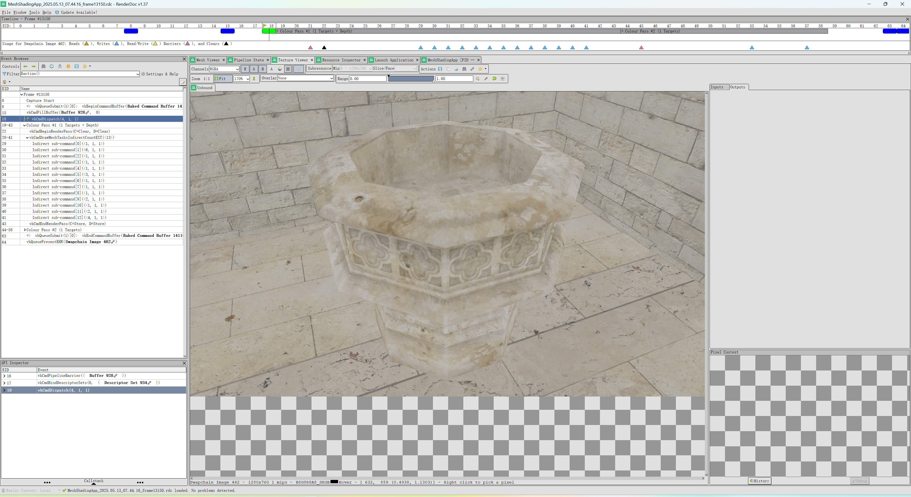

# 灵泽 Vulkan 引擎

<div align="right">
  <a href="#readme-english">English</a> | <b>中文</b>
</div>

## 简介

灵泽是一个基于Vulkan API的轻量级渲染引擎，专注于提供高效、灵活的图形渲染功能。该引擎封装了Vulkan的复杂底层细节，提供简洁的API接口，简化了渲染管线的构建过程，同时保留了对底层API的直接访问能力，用于个人图形学习和项目开发。

## 项目结构

项目采用模块化设计，主要包含以下组件：

```
Lingze/
├── src/                      # 源代码目录
│   ├── backend/              # 核心引擎后端
│   │   ├── Core.h/cpp        # 引擎核心类，管理Vulkan实例和设备
│   │   ├── RenderGraph.h/cpp # 渲染图系统
│   │   ├── App.h/cpp         # 应用程序基类
│   │   ├── Buffer.h/cpp      # 缓冲区管理
│   │   ├── Image.h/cpp       # 图像资源管理
│   │   └── ...               # 其他核心组件
│   ├── render/               # 渲染系统
│   │   ├── common/           # 通用渲染组件
│   ├── scene/                # 场景管理系统
│   │   ├── Scene.h/cpp       # 场景类，管理对象和材质
│   │   └── Mesh.h/cpp        # 网格数据和加载
│   └── application/          # 示例应用程序
│       ├── EntryPoint.h      # 应用程序入口点宏
│       ├── $Example$App      # 渲染示例
├── shaders/                  # 着色器目录
│   ├── glsl/                 # GLSL源代码
│   ├── hlsl/                 # HLSL源代码
│   ├── spirv_glsl/           # 编译后spirv文件     
│   └── spirv_hlsl/           # 编译后spirv文件 
├── deps/                     # 第三方依赖
├── data/                     # 资源数据（模型、纹理等）
└── CMakeLists.txt            # CMake构建配置
```

项目使用以下示例应用程序展示引擎功能：

- **SimpleTriangleApp**：演示最基本的三角形渲染，展示Vulkan渲染管线的基础用法
- **BasicShapeApp**：展示如何加载和渲染3D模型，包括立方体等基础几何体

通过继承`lz::App`基类并实现必要的方法，可以创建自定义渲染应用。

## 安装

### 前提条件

- C++17或更高版本的编译器
- Vulkan SDK 1.2或更高版本
- CMake 3.12或更高版本
- GLFW3库 (窗口管理)

### 构建过程

```bash
git clone https://github.com/yourusername/lingze.git
cd lingze
mkdir build && cd build
cmake ..
cmake --build .
```

## 功能实现状态

- **核心渲染功能**
  - [x] 基础几何渲染
  - [x] Mesh Shader & Task Shader
  - [x] 无绑定材质系统
  - [ ] 渲染图架构
    - [ ] 有向无环图模式
  - [ ] PBR材质系统
  - [ ] 实时阴影
  - [ ] 环境光遮蔽 (SSAO)
  - [ ] 光线追踪

- **渲染优化技术**
  - [x] GPU Driven Rendering
    - [x] 视锥剔除 (Frustum Culling)
    - [x] 锥形剔除 (Cone Culling)
    - [x] 背面剔除 (Backface Culling)
    - [x] 小三角形剔除 (Small Triangle Culling)
    - [ ] 遮挡剔除 (Occlusion Culling)
  - [ ] 细节层次 (LOD)
  - [ ] 实例化渲染

- **场景系统**
  - [x] 网格加载
    - [x] OBJ模型导入
    - [x] glTF模型导入
  - [x] 场景图
  - [ ] 场景编辑器

- **系统与工具**
  - [x] 基础ImGui集成
  - [ ] 自动内存管理
  - [ ] 资源热重载
  - [ ] 多线程命令生成

## 运行截图
<div align="center">
  
  <br>
  <em>图1: Mesh Shading技术的演示效果</em>
</div>

<div align="center">
  
  <br>
  <em>图2: Mesh与Task Shader结合间接绘制的效果展示</em>
</div>

## 参考文档和仓库

以下是开发过程中参考的文档和仓库：

- **官方文档**
  - [Vulkan 规范](https://www.khronos.org/registry/vulkan/)
  - [Vulkan 教程](https://vulkan-tutorial.com/)
  - [Vulkan 指南](https://github.com/KhronosGroup/Vulkan-Guide)

- **开源引擎和框架**
  - [LegitEngine](https://github.com/Raikiri/LegitEngine) 
  - [Xihe](https://github.com/zoheth/Xihe)
  - [Filament](https://github.com/google/filament)
  - [Granite](https://github.com/Themaister/Granite)
  - [V-EZ](https://github.com/GPUOpen-LibrariesAndSDKs/V-EZ)
  - [bgfx](https://github.com/bkaradzic/bgfx)
  - [niagara](https://github.com/zeux/niagara)

- **学习资源**
  - [GPU Gems系列](https://developer.nvidia.com/gpugems/gpugems/foreword)
  - [Vulkan GPU Insights](https://www.gpuinsights.com/)
  - [LearnOpenGL](https://learnopengl.com/)
  - [mesh_shaders-from_vertex_shader_to_mesh_shader](https://gpuopen.com/learn/mesh_shaders/mesh_shaders-from_vertex_shader_to_mesh_shader/) 

---

<a name="readme-english"></a>

# Lingze Vulkan Engine

<div align="right">
  <b>English</b> | <a href="#">中文</a>
</div>

## Introduction

Lingze is a lightweight rendering engine based on the Vulkan API, focused on providing efficient and flexible graphics rendering capabilities. The engine encapsulates the complex low-level details of Vulkan, provides a clean API interface, simplifies the rendering pipeline construction process, and retains direct access to the underlying API, making it suitable for graphics learning and project development.

## Project Structure

The project uses a modular design with a clear code structure, comprised of the following main components:

```
Lingze/
├── src/                      # Source code directory
│   ├── backend/              # Core engine backend
│   │   ├── Core.h/cpp        # Engine core class, manages Vulkan instances and devices
│   │   ├── RenderGraph.h/cpp # Render graph system
│   │   ├── App.h/cpp         # Application base class
│   │   ├── Buffer.h/cpp      # Buffer management
│   │   ├── Image.h/cpp       # Image resource management
│   │   └── ...               # Other core components
│   ├── render/               # Rendering system
│   │   ├── common/           # Common rendering components
│   ├── scene/                # Scene management system
│   │   ├── Scene.h/cpp       # Scene class, manages objects and materials
│   │   └── Mesh.h/cpp        # Mesh data and loading
│   └── application/          # Example applications
│       ├── EntryPoint.h      # Application entry point macro
│       ├── %Example%App      # Rendering example
├── shaders/                  # Shader directory
│   ├── glsl/                 # GLSL source code
│   ├── hlsl/                 # HLSL source code
│   ├── spirv_glsl/           # Compiled SPIR-V bytecode
│   └── spirv_hlsl/           # Compiled SPIR-V bytecode
├── deps/                     # Third-party dependencies
├── data/                     # Resource data (models, textures, etc.)
└── CMakeLists.txt            # CMake build configuration
```

The engine functionality is demonstrated through the following example applications:

- **SimpleTriangleApp**: Demonstrates the most basic triangle rendering, showcasing the fundamentals of the Vulkan rendering pipeline
- **BasicShapeApp**: Shows how to load and render 3D models, including basic geometric shapes like cubes

Custom rendering applications can be created by inheriting from the `lz::App` base class and implementing the necessary methods.

## Installation

### Prerequisites

- C++17 or higher compiler
- Vulkan SDK 1.2 or higher
- CMake 3.12 or higher
- GLFW3 library (window management)

### Build Process

```bash
git clone https://github.com/yourusername/lingze.git
cd lingze
mkdir build && cd build
cmake ..
cmake --build .
```

## Feature Implementation Status

- **Core Rendering Features**
  - [x] Basic Geometry Rendering
  - [x] Mesh Shader & Task Shader
  - [x] Bindless Material System
  - [ ] Render Graph Architecture
    - [ ] DAG Mode
  - [ ] PBR Material System
  - [ ] Real-time Shadows
  - [ ] Ambient Occlusion (SSAO)
  - [ ] Deferred Rendering

- **Rendering Optimization**
  - [x] GPU Driven Rendering
    - [x] Frustum Culling
    - [x] Cone Culling
    - [x] Backface Culling
    - [x] Small Triangle Culling
    - [ ] Occlusion Culling
  - [ ] Level of Detail (LOD)
  - [ ] Instanced Rendering

- **Scene System**
  - [x] Mesh Loading
    - [x] OBJ Model Import
    - [x] glTF Model Import
  - [x] Scene Graph
  - [ ] Scene Editor

- **Systems & Tools**
  - [x] Basic ImGui Integration
  - [ ] Automatic Memory Management
  - [ ] Performance Profiling
  - [ ] Multi-threaded Command Generation

## Screenshots
<div align="center">
  
  <br>
  <em>Figure 1: Demonstration of Mesh Shading technology</em>
</div>

<div align="center">
  
  <br>
  <em>Figure 2: Showcasing Mesh and Task Shaders with indirect drawing</em>
</div>

## Reference Documentation and Repositories

The following documentation and repositories were referenced during development:

- **Official Documentation**
  - [Vulkan Specification](https://www.khronos.org/registry/vulkan/)
  - [Vulkan Tutorial](https://vulkan-tutorial.com/)
  - [Vulkan Guide](https://github.com/KhronosGroup/Vulkan-Guide)

- **Open Source Engines and Frameworks**
  - [LegitEngine](https://github.com/Raikiri/LegitEngine)
  - [Xihe](https://github.com/zoheth/Xihe)
  - [Filament](https://github.com/google/filament)
  - [Granite](https://github.com/Themaister/Granite)
  - [V-EZ](https://github.com/GPUOpen-LibrariesAndSDKs/V-EZ) 
  - [bgfx](https://github.com/bkaradzic/bgfx)
  - [niagara](https://github.com/zeux/niagara)

- **Learning Resources**
  - [GPU Gems Series](https://developer.nvidia.com/gpugems/gpugems/foreword)
  - [Vulkan GPU Insights](https://www.gpuinsights.com/)
  - [LearnOpenGL](https://learnopengl.com/)
  - [mesh_shaders-from_vertex_shader_to_mesh_shader](https://gpuopen.com/learn/mesh_shaders/mesh_shaders-from_vertex_shader_to_mesh_shader/)